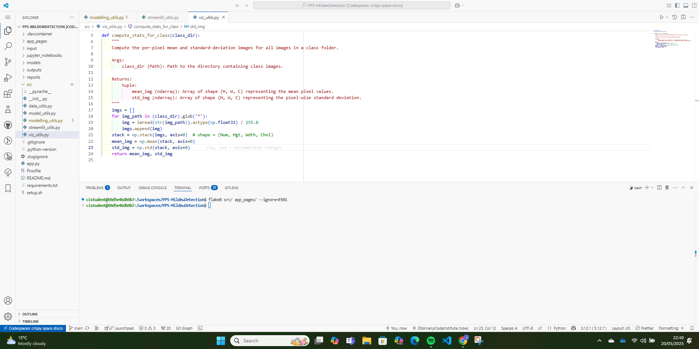

# Cherry Leaf Powdery Mildew Detector

Our Cherry Leaf Mildew Detector is a full end-to-end predictive analytics solution built to automate the detection of powdery mildew on cherry leaves using a dataset of over 4,000 labelled leaf images.

This README lays out the project's pathway through the CRISP-DM process:

1. **Data Collection & Preparation**: Download and clean the Kaggle cherry-leaves dataset, then split it into train/validation/test with a fixed seed.  
2. **Data Visualization**: Explore class balance, image dimensions, per-class mean/std images, variance maps, and sample montages.  
3. **Modeling & Evaluation**: Define, train, and tune a custom CNN with EarlyStopping; export metrics, history, and artifacts.  
4. **Interactive Dashboard**: Deploy a multipage Streamlit app that documents objectives, visual insights, preprocessing controls, training curves, validation metrics, and a live “Diagnosis Station” for user uploads.

Scroll down to learn more about the dataset, business requirements, hypotheses, dashboard design, and deployment instructions.

---

## Contents

- [Cherry Leaf Powdery Mildew Detector](#cherry-leaf-powdery-mildew-detector)
  - [Contents](#contents)
  - [Dataset Content](#dataset-content)
  - [Business Requirements](#business-requirements)
  - [Hypotheses \& Validation](#hypotheses--validation)
  - [The rationale to map the Business Requirements to the Data Visualisations and ML tasks](#the-rationale-to-map-the-business-requirements-to-the-data-visualisations-and-ml-tasks)
  - [ML Business Case](#ml-business-case)
  - [Epics and User Stories](#epics-and-user-stories)
    - [Epic – Data Collection \& Ingestion](#epic--data-collection--ingestion)
    - [Epic – Data Understanding \& Visualisation](#epic--data-understanding--visualisation)
    - [Epic – Modelling \& Evaluation](#epic--modelling--evaluation)
    - [Epic – Dashboard Planning \& Development](#epic--dashboard-planning--development)
    - [Epic – Deployment \& Documentation](#epic--deployment--documentation)
  - [Dashboard Design](#dashboard-design)
  - [Unfixed Bugs](#unfixed-bugs)
  - [Deployment](#deployment)
    - [Render](#render)
  - [Forking \& Cloning the Repository](#forking--cloning-the-repository)
    - [Creating a Fork](#creating-a-fork)
    - [Cloning to Your Local Machine](#cloning-to-your-local-machine)
  - [Main Data Analysis \& ML Libraries](#main-data-analysis--ml-libraries)
  - [Testing](#testing)
    - [User Story Testing](#user-story-testing)
    - [Code Style Validator](#code-style-validator)
  - [Credits](#credits)
    - [Content](#content)
    - [Media](#media)

---

## Dataset Content

- **Source:** Kaggle – [codeinstitute/cherry-leaves](https://www.kaggle.com/codeinstitute/cherry-leaves)  
- **Description:** ~4 000 RGB images of cherry leaves labelled `healthy` or `powdery_mildew`.  
- **Post-processing structure:**
      input/datasets/cherry_leaf_dataset/cherry-leaves/ ├─ train/ (70 % of images)
      ├─ validation/ (10 %)
      └─ test/ (20 %)

- **Preparation steps:**

1. Remove non-image files
2. Split into train/validation/test with a fixed seed for reproducibility
3. Verify class balance via counts

[⬆ Back to Contents](#contents)

---

## Business Requirements

1. **Visual Study:**  
 Agronomists need side-by-side comparisons of healthy vs. infected leaves to understand mildew indicators.  
2. **Automated Detection:**  
 A real-time CNN must classify a leaf image as *Healthy* or *Powdery Mildew* in under 1 s, achieving ≥ 90 % recall on the mildew class to guide rapid treatment across thousands of trees.

[⬆ Back to Contents](#contents)

---

## Hypotheses & Validation

1. **Model Accuracy Hypothesis**  
   A CNN fine-tuned on cherry-leaf images will achieve **≥ 90 % recall** on the *Powdery Mildew* class.  
   **Validation:** Evaluate on the held-out test set; compute recall and its 95 % confidence interval; perform a one-sample t-test against a 50 % random-guess baseline (α = 0.05).

2. **Image Variance Hypothesis**  
   Powdery mildew leaves exhibit **higher pixel-intensity variance** than healthy leaves.  
   **Validation:** Compute per-image variance; compare healthy vs. mildew distributions with a two-sample t-test (α = 0.05).

3. **Mean Intensity Hypothesis**  
   The **mean pixel intensity** of mildew-infected leaves differs significantly from healthy leaves.  
   **Validation:** Compute per-image mean intensity; apply a two-sample t-test (α = 0.05) to test for a significant class-wise difference.

4. **Learning-Rate & EarlyStopping Hypothesis**  
   **Lowering** the learning rate to 1 × 10⁻⁴ **and** using EarlyStopping produces **smoother convergence** and **higher final validation accuracy** than the initial higher learning rate.  
   **Validation:** Compare Run 1 (LR = 1 × 10⁻³, no EarlyStopping) vs. Run 2 (LR = 1 × 10⁻⁴, EarlyStopping) learning curves; quantify oscillations and plateau onset via epoch-wise val_loss variance and peak val_accuracy.

[⬆ Back to Contents](#contents)

---

## The rationale to map the Business Requirements to the Data Visualisations and ML tasks

- **Business Requirement 1: Visual Study**  
  - We need to confirm that our dataset is balanced so the model isn’t biased towards one class → **Class-count bar chart**.  
  - We must ensure all images share consistent dimensions to avoid distortions in training → **Width vs. height scatter plot**.  
  - We want to uncover average colour/texture patterns that distinguish healthy vs. diseased leaves → **Per-class mean & variability maps**.  
  - We need to highlight precisely where powdery mildew alters pixel intensity → **Difference heat-map (mildew minus healthy)**.  
  - We ought to qualitatively inspect real examples to validate labelling and feature presence → **Random sample montages**.  
  - **Implemented in Notebook 2: Data Visualisation & Leaf Atlas page.**

- **Business Requirement 2: Automated Detection (≥ 90 % recall)**  
  - We must build a robust CNN that can classify a 256×256 leaf image in under 1 s → **Custom 3-block CNN with BatchNorm, Dropout**.  
  - We require strong generalisation to new field conditions → **ImageDataGenerator augmentations** (rotation, zoom, shifts, flips).  
  - We need to find the optimal learning rate and stopping criteria to smooth convergence → **Run 1 vs Run 2 learning-rate comparison + EarlyStopping**.  
  - We must measure model performance on held-out data and verify recall on the mildew class → **Confusion matrix**, **classification report**, **live recall gauge**.  
  - We want end-users to upload new images and receive predictions with confidence → **Diagnosis Station page** (uploader, threshold slider, confidence gauges, CSV export).  
  - **Implemented in Notebook 3: Modelling & Evaluating and Notebook 4: Hypothesis Testing, plus Streamlit pages Training Dashboard, Validation & Insights, Hypotheses Validation, and Diagnosis Station.**

[⬆ Back to Contents](#contents)

---

## ML Business Case

- **Aim:** Detect powdery mildew on cherry leaves with high recall.  
- **Method:** Custom CNN (3× Conv→BatchNorm→Pool blocks + dropout).  
- **Ideal Outcome:**  
- Recall (mildew) ≥ 0.90  
- Accuracy ≥ 0.95  
- F1-score ≥ 0.90  
- **Success Metrics:**  
- Primary: test-set recall on mildew class
- Secondary: overall accuracy, confusion matrix, classification report  
- **Data:** 256×256 px RGB images, augmented (rotation, shifts, zoom, flips).  
- **Reproducibility:** seeded data splits and augmentation.

[⬆ Back to Contents](#contents)

---

## Epics and User Stories

- The project was organised into five Epics aligned with our CRISP-DM phases; under each Epic are User Stories to drive an agile workflow.

### Epic – Data Collection & Ingestion

- **User Story** – As a data engineer, I can fetch the cherry-leaf dataset from Kaggle so that I have all images available locally.
- **User Story** – As a data engineer, I can remove any non-image files so that my dataset contains only valid leaf images.

### Epic – Data Understanding & Visualisation

- **User Story** – As an agronomist, I can view class-count bar charts so I can confirm healthy vs. mildew samples are balanced (Business Requirement 1).
- **User Story** – As a data scientist, I can explore image-shape distributions, mean & variance maps, and difference heat-maps to uncover key visual patterns.
- **User Story** – As a domain expert, I can browse random sample montages to qualitatively inspect powdery-mildew symptoms.

### Epic – Modelling & Evaluation

- **User Story** – As a machine-learning engineer, I can build and augment a CNN pipeline to classify leaves as healthy or powdery-mildew.
- **User Story** – As a data scientist, I can compare two training runs (different learning rates and EarlyStopping) to select the best configuration (Hypothesis 4).
- **User Story** – As a statistician, I can evaluate test-set recall on mildew images, generate a confusion matrix, and run statistical tests to verify model recall ≥ 90 %(Hypothesis 1).
- **User Story** – As a data analyst, I can perform t-tests on pixel mean and variance to validate that mildew-infected leaves differ significantly from healthy ones (Hypotheses 2 & 3).

### Epic – Dashboard Planning & Development

- **User Story** – As a non-technical user, I can read a Project Charter page with objectives, user stories, hypotheses, and a live recall gauge.
- **User Story** – As an analyst, I can interact with the Leaf Atlas to filter classes, view histograms/scatter plots, and see sample collages.
- **User Story** – As a model developer, I can experiment with augmentation parameters in the Preprocessing Playground and see immediate visual feedback.
- **User Story** – As a reviewer, I can explore the Training Dashboard plots (loss/accuracy curves and top epochs) to understand convergence behaviour.
- **User Story** – As a stakeholder, I can examine Validation & Insights—a confusion matrix, variance boxplot, and recall-target alert—to decide if the model meets business needs.
- **User Story** – As an end user, I can upload new leaf images in the Diagnosis Station, adjust the decision threshold, view confidence gauges, and download batch results.

### Epic – Deployment & Documentation

- **User Story** – As a developer, I can follow the README instructions and included setup scripts to deploy the dashboard on Render.
- **User Story** – As a collaborator, I can clone the repo, install dependencies (including requests/gdown), and run the app locally.
- **User Story** – As a project manager, I can read these epics and user stories in the README to quickly understand project scope and deliverables.

[⬆ Back to Contents](#contents)

---

## Dashboard Design

**Streamlit multipage app** with six pages:

1. **Project Charter**

   - Overview, objectives, user stories, hypotheses, live recall gauge

2. **Leaf Atlas**

   - Class-filter sidebar, variance histogram + boxplot, mean-vs-variance scatter, sample collage

3. **Preprocessing Playground**

   - Sliders/checkboxes for augmentation parameters, original vs. augmented preview

4. **Training Dashboard**

   - Metric selector (loss/accuracy), train vs. val curves, top-5 validation epochs bar chart

5. **Validation & Insights**

   - Confusion matrix image, success/failure alert (live recall), pixel-variance boxplot, next-steps expander

6. **Hypotheses Validation**

   - Welch’s t-tests on pixel mean & variance and a one-sample t-test on model recall, with p-values and conclusions.

7. **Diagnosis Station**

   - File uploader, threshold slider, prediction gauge, batch results table + CSV download

[⬆ Back to Contents](#contents)

---

## Unfixed Bugs

- **IDE lint warnings** on `tensorflow.keras` imports—safe to ignore if environment is correct.  
- **Model file size** tracked via `.gitignore` and external load pattern.  
- **Collage layout** may shift slightly depending on sample count—acceptable for current scope.

[⬆ Back to Contents](#contents)

---

## Deployment

### Render

- The App live link is: `https://pp5-mildewdetection.onrender.com/`
- Set the .python-version file Python version to 3.12.
- The project was deployed to Render using the following steps.

1. Ensure models/*.h5 is included in your .gitignore file as it contains too much data to submit to GitHub.
2. Go to render.com and create a new Web Service. **Add New** then **Web Service**.
3. Connect your GitHub account and select your repository (and branch if you have multiple).
4. We chose the **Standard** payment model which permits 2 GB RAM as our project does not fit in the smaller tiers.
5. The build command is left as default (pip install -r requirements.txt ).
6. The start command is set to run a Streamlit server with an exported port and a server flag that permits external traffic:
   - streamlit run app.py --server.port $PORT --server.address 0.0.0.0
7. No environment variables are required.
8. Select **Manual Deploy** then **Deploy Latest Commit**.
9. Once "Live" turns green, the URL provided will allow you to access the deployed project.

[⬆ Back to Contents](#contents)

---

## Forking & Cloning the Repository

Use the steps below to create your own copy of this project and work on it locally.

### Creating a Fork

1. Navigate to the repository’s main page on GitHub.  
2. Click the **Fork** button in the top-right corner.  
3. Choose your GitHub account (or organisation) as the destination.  
4. *Optional:* Rename the fork if you want to distinguish it from the original.  
5. *Optional:* Add a brief description for your fork.  
6. Click **Create fork** and wait for GitHub to finish copying the repo.

### Cloning to Your Local Machine

1. Go to your newly-forked repository on GitHub.  
2. Click the green **Code** button and copy the HTTPS URL.  
3. Open a terminal (or your IDE’s integrated console) and cd into the folder where you’d like the project to live.  
4. Run:

   ```bash
   git clone https://github.com/<your-username>/PP5-MildewDetection.git
   ```

5. Press Enter and wait for the clone to complete.
6. Change into the project directory:

[⬆ Back to Contents](#contents)

---

## Main Data Analysis & ML Libraries

- **TensorFlow / Keras:** model definition, training, evaluation  
- **scikit-learn:** confusion matrix, classification report  
- **Pandas / NumPy:** data manipulation, CSV/JSON exports  
- **Plotly Express & Graph Objects:** interactive charts  
- **Seaborn / Matplotlib:** static visualizations  
- **Streamlit:** dashboard framework, caching, widgets  

[⬆ Back to Contents](#contents)

---

## Testing

### User Story Testing

- Dashboard pages were manually tested using the user stories as acceptance criteria.
- Jupyter notebooks were assumed correct if their final outputs (saved figures, CSV/JSON artifacts, model files) were produced without errors—manual testing against notebook user stories was not performed.

---

*As a non-technical user, I can view a project summary that describes the project, dataset and business requirements to understand the project at a glance.*

| Feature               | Action                       | Expected Result                                                                                | Actual Result     |
|-----------------------|------------------------------|------------------------------------------------------------------------------------------------|-------------------|
| Project Charter page  | Navigate via sidebar         | Page loads with overview, objectives, hypotheses and live recall gauge                         | Functions as intended |

---

*As an analyst, I can explore per-image statistics and sample collages in the Leaf Atlas (Business Requirement 1).*

| Feature            | Action                       | Expected Result                                                                                         | Actual Result     |
|--------------------|------------------------------|---------------------------------------------------------------------------------------------------------|-------------------|
| Leaf Atlas page    | Navigate via sidebar         | Histogram, scatter and collage widgets appear and respond to class‐filter and sample‐size controls      | Functions as intended |

---

*As a model developer, I can experiment with augmentation parameters and preview results in the Preprocessing Playground.*

| Feature                         | Action                                  | Expected Result                                                          | Actual Result     |
|---------------------------------|-----------------------------------------|--------------------------------------------------------------------------|-------------------|
| Preprocessing Playground page   | Navigate via sidebar                    | Sliders/checkboxes appear in sidebar                                     | Functions as intended |
|                                 | Adjust rotation, zoom, shifts or flips  | Raw vs. augmented images update accordingly in real time                 | Functions as intended |

---

*As a reviewer, I can inspect training and validation curves and top epochs in the Training Dashboard.*

| Feature                       | Action                       | Expected Result                                                         | Actual Result     |
|-------------------------------|------------------------------|-------------------------------------------------------------------------|-------------------|
| Training Dashboard page      | Navigate via sidebar         | Line chart of loss/accuracy and bar chart of top-5 epochs are displayed | Functions as intended |
|                               | Switch metric selector       | Plot updates between loss and accuracy                                   | Functions as intended |

---

*As a stakeholder, I can examine the confusion matrix, recall alert and variance boxplot in Validation & Insights (Business Requirement 2).*

| Feature                     | Action                        | Expected Result                                                                         | Actual Result     |
|-----------------------------|-------------------------------|-----------------------------------------------------------------------------------------|-------------------|
| Validation & Insights page | Navigate via sidebar          | Confusion matrix image, success/failure recall alert, and variance boxplot are displayed | Functions as intended |

---

*As a statistician, I can review our statistical tests on pixel statistics and model recall in Hypotheses Validation.*

| Feature                       | Action                       | Expected Result                                                                                 | Actual Result     |
|-------------------------------|------------------------------|-------------------------------------------------------------------------------------------------|-------------------|
| Hypotheses Validation page    | Navigate via sidebar         | Test statistics and p-values for variance, mean and recall appear with plain-English explanations| Functions as intended |

---

*As an end user, I can upload new leaf images, adjust threshold, view confidence gauges and download CSV in the Diagnosis Station.*

| Feature                     | Action                       | Expected Result                                                                              | Actual Result     |
|-----------------------------|------------------------------|----------------------------------------------------------------------------------------------|-------------------|
| Diagnosis Station page     | Navigate via sidebar         | File uploader, threshold slider and placeholders for images/gauges are displayed             | Functions as intended |
|                             | Upload one or more images    | Each image is shown with a confidence gauge and raw probability                             | Functions as intended |
|                             | Download batch results CSV   | ‘Download results as CSV’ button produces a downloadable CSV of predictions                 | Functions as intended |

[⬆ Back to Contents](#contents)

---

### Code Style Validator

We ran **Flake8** over our application code (excluding long-line checks) to ensure there were no other style or syntax issues:

```bash
flake8 src/ app_pages/ --ignore=E501
```

- E501 (line-too-long) was deliberately ignored, since most long lines are user-facing strings in the Streamlit UI and do not impact functionality.

- Result: No other warnings or errors were reported, confirming our code conforms to PEP8 style guidelines outside of permitted long strings.



[⬆ Back to Contents](#contents)

---

## Credits

### Content

- CRISP-DM methodology inspired by industry best practices.
- Code Institute's malaria identifier walkthrough project has been the foundation for the Cherry Leaf Mildew detector, particularly around 'what' and 'when' to do in the jupyter notebooks.
- Business narrative adapted from Farmy & Foods case study provided by Code Institute.
- Gauge plot guidlines from [Plotly](https://plotly.com/python/gauge-charts/)
- Streamlit data cache decorator [st.cache_data](https://docs.streamlit.io/develop/api-reference/caching-and-state/st.cache_data)
- Easy implementation of interactive plotly charts via Streamlit [st.plotly_chart](https://docs.streamlit.io/develop/api-reference/charts/st.plotly_chart)
- [Keras guide on binary classification](https://keras.io/examples/).

### Media

- Cherry-leaf images sourced from Kaggle: `codeinstitute/cherry-leaves`.  
- Icons via Unicode and Plotly defaults.

[⬆ Back to Contents](#contents)

---
